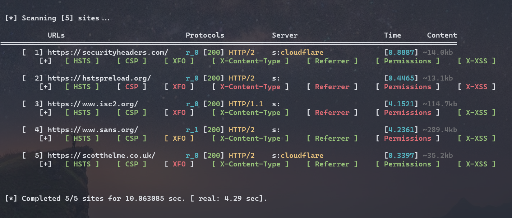

# Tool: httphdr_scan
This is a tool (written in Python) to perform quick scan on HTTP version and headers.

It's features include:
 - showing HTTP version and server headers
 - showing the security HTTP header with different color (verbose)
 - can scan spcific URL
 - can scan a list of sites from an input file
 - allow to follow [301] redirection
 - always make async connections

# Usage
```bash
$ ./main.py -h
usage: main.py [-h] [-u <url> [<url> ...]] [-f <sites.url>] [-r] [-v]

options:
  -h, --help            show this help message and exit
  -u <url> [<url> ...]  Specifying URL
  -f <sites.url>        Specifying input site file
  -r                    Follow HTTP 301 redirection.
  -v                    verbose output
```

## Samples
Below is the sample output, showing the scan of 5 default sites.


